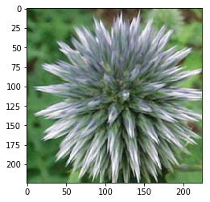
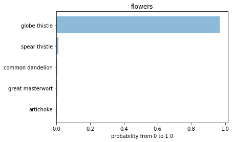

# AI Programming with Python Project

Project code for Udacity's AI Programming with Python Nanodegree program. In this project, students first develop code for an image classifier built with PyTorch, then convert it into a command line application.

# Getting Started

Going forward, AI algorithms will be incorporated into more and more everyday applications. For example, you might want to include an image classifier in a smart phone app. To do this, you'd use a deep learning model trained on hundreds of thousands of images as part of the overall application architecture. A large part of software development in the future will be using these types of models as common parts of applications. In this project, you'll train an image classifier to recognize different species of flowers. You can imagine using something like this in a phone app that tells you the name of the flower your camera is looking at. In practice you'd train this classifier, then export it for use in your application. We'll be using this dataset of 102 flower categories, you can see a few examples below.


The project is broken down into multiple steps:

* Load and preprocess the image dataset
* Train the image classifier on your dataset
* Use the trained classifier to predict image content

We'll lead you through each part which you'll implement in Python.
When you've completed this project, you'll have an application that can be trained on any set of labeled images. Here your network will be learning about flowers and end up as a command line application. But, what you do with your new skills depends on your imagination and effort in building a dataset. For example, imagine an app where you take a picture of a car, it tells you what the make and model is, then looks up information about it. Go build your own dataset and make something new.

### Prerequisites

Thinks you have to install or installed on your working machine:

* Python 3.7
* Numpy (win-64 v1.15.4)
* Pandas (win-64 v0.23.4)
* Matplotlib (win-64 v3.0.2)
* Jupyter Notebook
* Torchvision (win-64 v0.2.1)
* PyTorch (win-64 v0.4.1)

### Environment:
* [Miniconda](https://conda.io/miniconda.html) or [Anaconda](https://www.anaconda.com/download/)


### Installing

Use the package manager [pip](https://pip.pypa.io/en/stable/) or
[miniconda](https://conda.io/miniconda.html) or [Anaconda](https://www.anaconda.com/download/) to install your packages.  
A step by step guide to install the all necessary components in Anaconda for a Windows-64 System:
```bash
conda install -c conda-forge numpy
conda install -c conda-forge pandas
conda install -c conda-forge matplotlib
pip install torchvision
conda install -c pytorch pytorch
```

## Jupyter Notebook
* `Image Classifier Project.ipynb`

This jupyter notebook describe the whole project from udacity, from the beginning to the end.

## Running the project

The whole project is located in the file `Image Classifier Project.py` and it's include the training and the prediction part.
Based on this implementation the jupyter notebook was created from this.

```----- running with params -----
data directory:  flowers
save directory:  ./
architecture:    vgg13
learning rate:   0.001
hidden units:    500
epochs:          3
gpu:             True
-------------------------------
cnn neural network ...
  load image data ... done
  
  done
initialized.
start deep-learning in -gpu- mode ... 
epoch: 1/3..  training loss: 4.739..  validation loss: 3.941..  validation accuracy: 0.185
epoch: 1/3..  training loss: 4.100..  validation loss: 3.462..  validation accuracy: 0.261
epoch: 1/3..  training loss: 3.778..  validation loss: 2.932..  validation accuracy: 0.357
epoch: 1/3..  training loss: 3.443..  validation loss: 2.537..  validation accuracy: 0.423
epoch: 1/3..  training loss: 3.237..  validation loss: 2.177..  validation accuracy: 0.481
epoch: 1/3..  training loss: 3.069..  validation loss: 1.971..  validation accuracy: 0.512
epoch: 1/3..  training loss: 2.817..  validation loss: 1.731..  validation accuracy: 0.553
epoch: 1/3..  training loss: 2.751..  validation loss: 1.686..  validation accuracy: 0.581
epoch: 1/3..  training loss: 2.782..  validation loss: 1.538..  validation accuracy: 0.618
epoch: 1/3..  training loss: 2.391..  validation loss: 1.446..  validation accuracy: 0.627
epoch: 2/3..  training loss: 1.764..  validation loss: 1.364..  validation accuracy: 0.641
epoch: 2/3..  training loss: 2.310..  validation loss: 1.248..  validation accuracy: 0.668
epoch: 2/3..  training loss: 2.308..  validation loss: 1.183..  validation accuracy: 0.685
epoch: 2/3..  training loss: 2.345..  validation loss: 1.149..  validation accuracy: 0.697
epoch: 2/3..  training loss: 2.188..  validation loss: 1.096..  validation accuracy: 0.721
epoch: 2/3..  training loss: 2.222..  validation loss: 1.100..  validation accuracy: 0.709
epoch: 2/3..  training loss: 2.135..  validation loss: 1.033..  validation accuracy: 0.714
epoch: 2/3..  training loss: 2.136..  validation loss: 1.091..  validation accuracy: 0.694
epoch: 2/3..  training loss: 2.117..  validation loss: 0.981..  validation accuracy: 0.739
epoch: 2/3..  training loss: 2.213..  validation loss: 0.968..  validation accuracy: 0.746
epoch: 3/3..  training loss: 1.041..  validation loss: 0.886..  validation accuracy: 0.772
epoch: 3/3..  training loss: 1.999..  validation loss: 0.949..  validation accuracy: 0.744
epoch: 3/3..  training loss: 2.053..  validation loss: 0.849..  validation accuracy: 0.764
epoch: 3/3..  training loss: 1.859..  validation loss: 0.850..  validation accuracy: 0.756
epoch: 3/3..  training loss: 2.004..  validation loss: 0.851..  validation accuracy: 0.775
epoch: 3/3..  training loss: 1.925..  validation loss: 0.850..  validation accuracy: 0.751
epoch: 3/3..  training loss: 2.082..  validation loss: 0.865..  validation accuracy: 0.752
epoch: 3/3..  training loss: 1.996..  validation loss: 0.817..  validation accuracy: 0.799
epoch: 3/3..  training loss: 1.966..  validation loss: 0.826..  validation accuracy: 0.781
epoch: 3/3..  training loss: 1.805..  validation loss: 0.755..  validation accuracy: 0.809
-- done --
duration:  00:15:18
calculate accuracy on test ... done.
accuracy of the network on the 10000 test images: 77 %
duration:  00:00:18
save model to:  ./checkpoint.pth ... done
----- running with params -----
image file:      ./flowers/test/10/image_07117.jpg
load file:       checkpoint.pth
top k:           5
category names:  cat_to_name.json
gpu:             True
-------------------------------
load model from:  checkpoint.pth
create model ... done
initialize model ... done

--- prediction ---
load image data ... done
get prediction ... done.
 1 with 0.967 is globe thistle
 2 with 0.014 is spear thistle
 3 with 0.007 is common dandelion
 4 with 0.006 is great masterwort
 5 with 0.002 is artichoke
------------------
load image data ... done

```

  

After this I will explain more in details the training and prediction steps.

### Train the model

To train the neural network (CNN), start the first part of file `Image Classifier Project.py` marked as `train`.

### Parameters of training

To change to input folder, the output size and some other parameters for the neural network, you can adapt these global constants inside the python file.
  
  
